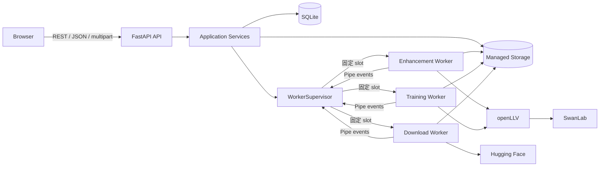
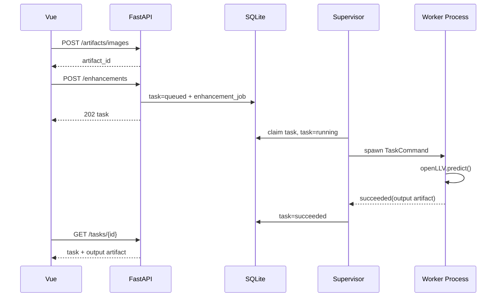

# openLLV WebUI 重构架构

> 状态：提案  
> 更新日期：2026-08-21

## 1. 目标

将当前 Gradio 单体应用重构为前后端分离的单机应用：

- 后端使用 FastAPI，对外提供稳定的 HTTP API。
- `openLLV.predict()`、`openLLV.train()` 等耗时调用运行在独立 worker 子进程中，不阻塞 Web 服务。
- 前端使用 Vue 3、TypeScript、shadcn-vue 和 Tailwind CSS v4。
- 继续使用 SQLAlchemy 和 SQLite 保存任务状态，继续使用本地目录保存上传文件、增强结果、数据集和训练 checkpoint。
- 保留现有图像增强、数据集下载、模型训练、任务记录和 SwanLab 集成功能。
- 首期保持单机、单 FastAPI 实例，不引入 Redis、Celery 等额外基础设施。

本次重构不是把 Gradio 回调逐个改成 API endpoint，而是拆开 HTTP、业务编排、任务调度和 openLLV 执行四个生命周期。

## 2. 非目标

首期不处理以下能力：

- 多用户、登录和权限系统。
- 多节点 worker 或跨机器 GPU 调度。
- 任意数量的 FastAPI 副本和横向扩容。
- 浏览器直接访问服务器任意文件路径。
- 为抽象而增加通用 repository、事件总线或插件框架。

## 3. 当前架构及问题

当前调用链为：

```text
Gradio component
  -> ui event handler
  -> inference facade
  -> daemon thread Worker/Slot
  -> openLLV / Hugging Face / SQLAlchemy
```

主要问题：

1. UI 事件、业务状态和后台任务生命周期绑定在同一个 Python 进程中。
2. `llv.predict()` 和 `llv.train()` 是阻塞调用，当前通过 daemon thread 执行。
3. 停止阻塞任务依赖 `ctypes.pythonapi.PyThreadState_SetAsyncExc()` 注入 `KeyboardInterrupt`，存在不可控的线程状态和资源清理风险。
4. `Slot` 只保存进程内 worker 引用，应用重启后无法恢复或判定遗留任务。
5. Gradio 组件既承担展示，又持有任务控制状态，难以形成稳定 API 合约。
6. 浏览器化前端不能继续把本机路径当作用户输入，文件和目录必须转成服务端管理的 artifact 或 dataset ID。
7. SwanLab API key 当前可在 UI 中修改进程内配置；前后端分离后，密钥不应下发或长期保存在浏览器中。

现有可继续利用的部分：

- `openLLV.predict()` 和 `openLLV.train()` 的参数编排。
- SQLAlchemy 任务记录字段和已有 SQLite 数据。
- 图片转换、输出路径、checkpoint 查找及 SwanLab 监控逻辑。
- Hugging Face 数据集逐文件下载和协作式取消逻辑。
- 现有 pytest 中对增强、训练、下载和数据库记录的行为约束。

## 4. 架构决策

### 4.1 单机模块化单体

首期部署为一个代码仓库、一个 FastAPI 服务和三个固定的 worker 子进程，分别负责增强、训练和数据集下载。每个 worker 同一时间只执行一个本类型任务，不同类型 worker 可以并行执行。SQLite 同时作为业务数据库和持久化任务队列。

这样可以解决 Web 进程被模型计算阻塞、任务状态不持久和线程取消不安全的问题，同时不立即引入消息中间件。

### 4.2 API 进程不执行 openLLV 任务

FastAPI 进程可以读取 openLLV catalog，但不得在请求线程或事件循环中调用耗时的 `predict()`、`train()`。应用 lifespan 使用 `multiprocessing` 的 `spawn` 模式启动三个固定 worker 进程；任务通过 control/command Pipe 发送给对应 worker，而不是每个任务动态创建一个进程。

使用 `spawn` 而不是 `fork` 的原因：

- 对 macOS、CUDA、MPS 和 PyTorch 初始化更安全。
- 避免继承 FastAPI 的数据库连接、线程和事件循环。
- 任务可以通过操作系统进程边界被可靠终止。

### 4.3 SQLite 是首期持久化队列

创建任务时先写入 `queued` 状态，再由 `WorkerSupervisor` 领取。API 返回 `202 Accepted`，不等待执行完成。

首期只允许一个 FastAPI server worker，从而保证只有一个 supervisor 领取队列。不能使用 `uvicorn --workers N`。需要多实例时，再把任务领取迁移到 PostgreSQL 和独立队列系统。

### 4.4 文件使用资源 ID，不接受任意路径

浏览器上传图片后得到 artifact ID；创建增强任务时提交 artifact ID，而不是服务器路径。训练任务引用受管理的 dataset ID，checkpoint 同样通过 artifact 或受管理目录引用。

所有真实路径都由后端根据配置目录解析，并检查解析结果仍位于允许的根目录内。

### 4.5 首期使用 REST 轮询

前端通过 `GET /api/v1/tasks/{id}` 轮询活跃任务，只获取状态、运行时间、消息和最终结果。

### 4.6 同步 SQLAlchemy 与 FastAPI 的边界

首期保留同步 SQLAlchemy，避免仅为 FastAPI 改写全部数据库代码。执行同步数据库操作的 route 使用普通 `def`，由 FastAPI 在线程池中调用；不得在 `async def` route 中直接执行同步 SQLAlchemy 查询。

Supervisor 使用独立线程和独立 Session，任何 Session 都不能跨线程或跨进程共享。

## 5. 总体架构



### FastAPI API

负责：

- HTTP 参数和 Pydantic schema 校验。
- 上传文件、返回 artifact 下载或预览响应。
- 创建、查询、筛选和取消任务。
- 返回 openLLV 可用算法、模型和数据集 catalog。
- 把业务异常映射成统一 HTTP 错误响应。

不负责：

- 在请求中直接执行 openLLV 推理或训练。
- 保存进程内唯一任务状态。
- 接受并直接使用客户端提供的任意文件路径。

### Application Services

负责一个完整用例的事务边界，例如：

- 校验 artifact 和方法类型后创建增强任务。
- 校验 dataset、设备和训练参数后创建训练任务。
- 原子地设置取消请求。
- 查询 task 及其 enhancement/training/download 详情。

Route 只调用 service，不直接操作 worker、openLLV 或拼接文件路径。当前规模不增加 repository 层；SQLAlchemy 查询集中在 service 和少量 `db/queries.py` 中，出现重复后再提取。

### WorkerSupervisor

作为 FastAPI lifespan 管理的单例组件，负责：

- 轮询并领取 `queued` 任务。
- 将任务按 `kind` 分配给三个固定 slot：`enhancement`、`training`、`dataset_download`。
- 保证每个 slot 同时最多运行一个任务，允许三个 slot 之间并行。
- 为每个固定 worker 维护 event/control Pipe。
- 在内存 `WorkerSlot` 中记录当前 task ID、进程句柄和 worker 事件。
- 处理取消、超时、异常退出和服务关闭。
- 把子进程结果写回数据库。

Supervisor 本身不调用 openLLV，只管理进程。

### Fixed Worker Process

每个固定 worker 进程负责一种任务类型，并在生命周期内串行处理该类型的多个任务。worker 进程句柄由对应的 `WorkerSlot` 保存在内存中，业务 task 只通过 `task_id + kind` 标识。Demo 阶段不持久化操作系统进程信息。

子进程执行流程：

1. 从固定 slot 的 command Pipe 读取 `TaskCommand`；空闲时阻塞等待，不占用任务进程之外的线程。
2. 在子进程内初始化 openLLV、SwanLab 等依赖。
3. 调用对应 handler。
4. 将 `started`、`succeeded` 或 `failed` 事件写入 Pipe。
5. 成功完成后等待 supervisor 的 `finalize` 或 `discard`，再清理本次 task 资源并回到空闲状态。
6. 取消或未捕获异常后退出，由 supervisor 为该 slot 创建干净的 worker 进程。

子进程同时持有父进程到子进程的 control Pipe。一个轻量控制循环监听 `cancel` 和 `shutdown`；下载 handler 收到 `cancel` 后设置本地 `threading.Event`，在文件边界退出。任务主逻辑不能直接读取跨进程的 Python 对象。

子进程不持有 FastAPI app，不复用父进程 SQLAlchemy engine，首期也不直接写数据库。

`workers/process.py` 的模块顶层只能使用标准库和 protocol 定义，禁止导入 FastAPI app、lifespan、database session、全局 engine 或会产生导入副作用的 package facade。handler 和 openLLV adapter 必须在固定 worker 入口确认 `worker_kind` 后 lazy import。

### Managed Storage

文件按职责分开：

```text
data/
|-- app.db
|-- uploads/       # 浏览器上传的原始文件
|-- output/        # 图像增强结果
|-- datasets/      # 受管理的数据集
|-- checkpoints/   # 模型训练结果
`-- tmp/           # 写入中的临时文件，可清理
```

worker 先写临时文件，成功后尽可能使用同文件系统内的原子 rename 发布结果。数据库只存相对 managed root 的路径和元数据，不保存图片二进制。

## 6. Worker 设计

### 6.1 任务状态机

统一状态：

```text
queued -> running -> succeeded
                  -> failed
                  -> cancelling -> cancelled
queued -------------------------> cancelled
```

字段建议：

| 字段 | 用途 |
| --- | --- |
| `id` | UUID 或不可猜测的字符串 ID |
| `kind` | `enhancement`、`training`、`dataset_download` |
| `status` | 状态机中的当前状态 |
| `message` | 面向用户的简短状态文本 |
| `error_code` | 稳定、可判断的错误代码 |
| `error_detail` | 已清理敏感信息的错误详情 |
| `created_at` | 创建时间 |
| `started_at` | 实际开始时间 |
| `finished_at` | 最终状态时间 |

状态更新必须校验允许的迁移，不能通过任意字符串覆盖状态。最终状态使用带旧状态条件的 compare-and-set 更新，不能先查询再无条件覆盖。

### 6.2 领取与并发

首期固定三个 slot：

```text
enhancement       -> 一个 Enhancement Worker，最多一个运行中增强任务
training          -> 一个 Training Worker，最多一个运行中训练任务
dataset_download  -> 一个 Download Worker，最多一个运行中下载任务
```

三个 slot 互不阻塞，可以同时执行一个增强、一个训练和一个下载任务。同一 `kind` 的后续任务保持 `queued`，等对应 worker 完成当前任务后按 `created_at, id` 顺序领取。

每个 slot 的领取步骤为一个短数据库事务：

1. 查询本 slot `kind` 对应的最早 `queued` task。
2. 将其更新为 `running` 并提交。
3. 通过该 slot 的 command Pipe 发送 `TaskCommand`。

由于首期只有一个 supervisor，不需要通用的资源竞争调度器。device 仍由服务端校验；增强和训练是否同时使用同一 GPU 由部署配置和实际显存决定，worker 层不再动态推导并发数。

任务请求中的 device 只能从服务端 catalog 中选择，例如 `auto`、`cpu`、`mps`、`cuda:0`；不把任意设备文本直接传给 handler。

### 6.3 父子进程协议

`workers/protocol.py` 定义可 pickle 的 dataclass，不传 Session、模型实例、打开的文件或 FastAPI 对象。

```text
TaskCommand
|-- task_id
|-- kind
|-- payload
`-- storage_paths

TaskEvent
|-- task_id
|-- type: started | succeeded | failed
|-- payload
`-- emitted_at

ControlMessage
|-- task_id
`-- type: cancel | shutdown | finalize | discard
```

父进程为每个固定 worker 维护两个方向明确的 Pipe：worker -> supervisor 的 event Pipe，以及 supervisor -> worker 的 control Pipe。event 只用于生命周期、结果和错误通知。

### 6.4 取消

`POST /api/v1/tasks/{id}/cancel` 的行为：

1. `queued` 任务直接转为 `cancelled`。
2. `running` 任务转为 `cancelling`，service 通过 control Pipe 通知 supervisor 管理的子进程。
3. 下载 handler 的 control loop 设置子进程内的本地 cancel event，在文件边界协作退出。
4. 阻塞的 openLLV handler 在 POSIX 下先收到 `SIGINT`，允许 Python 栈按 `KeyboardInterrupt` 清理。
5. 超过 `worker.cancel_grace_seconds` 仍未退出时通过当前 `WorkerSlot.process` 终止 worker；再次超时则使用平台支持的强制终止。
6. 子进程退出后由 supervisor 设置 `cancelled`，并清理未发布的临时文件。

不再使用 `PyThreadState_SetAsyncExc`。取消与自然完成通过数据库 compare-and-set 决定先后：取消只允许 `queued/running -> cancelled/cancelling`，成功只允许 `running -> succeeded`。若成功提交先发生，取消返回已完成的 `succeeded`；若取消先把任务置为 `cancelling`，随后收到的成功事件不能发布结果，必须清理临时产物并进入 `cancelled`。

### 6.5 服务启动与关闭

FastAPI lifespan 启动顺序：

1. 校验配置和 managed storage 目录。
2. 初始化 engine 和数据库 schema。
3. 执行遗留状态修复。
4. 启动 `WorkerSupervisor`，并创建 enhancement、training、dataset_download 三个固定 worker slot。
5. 标记 readiness 为可用。

关闭顺序：

1. readiness 变为不可用，不再领取新任务。
2. 停止 supervisor 领取新任务，但允许已有任务进入收尾流程。
3. 向三个 worker 发送 `shutdown`，等待固定宽限期。
4. 终止仍未退出的 worker process。
5. 对运行中的 task 写回最终状态并释放 engine。

启动时将遗留的 `running` 或 `cancelling` 任务按 `worker_lost` 标记为 `failed`，不扫描或持久化 PID。旧 worker 通过 control Pipe EOF 或 parent watchdog 自行退出；随后启动三个新的固定 worker。原有 `queued` 任务可以继续领取。不要自动重跑训练或推理，因为任务可能已产生部分输出。

Demo 阶段强制 `num_workers=0`，因此不需要为 dataloader 子进程维护额外的运行时信息。

开发模式 reload 会重启服务，因此不用于验证长时间训练；生产环境不得开启 reload。

### 6.6 三类任务的统一管理

增强、训练和数据集下载有不同的业务参数，但共享相同的运行生命周期。不要继续为它们分别维护 `EnhanceWorker`、`TrainWorker`、`DownloadWorker` 及对应的 `Slot`；统一使用三个固定 worker slot、同一个 worker process 入口和 handler registry。

统一运行时模型：

```text
TaskSpec
|-- task_id
|-- kind: enhancement | training | dataset_download
|-- payload
|-- resource: cpu | gpu | network
|-- cancel_policy
`-- storage_paths

WorkerSupervisor
|-- slots[enhancement]
|-- slots[training]
|-- slots[dataset_download]
|-- submit()
|-- cancel()
|-- poll()
|-- finalize()
`-- recover()
```

每个 slot 持有一个固定 worker process 和一对 Pipe；slot 内同一时间最多有一个 active task，三个 slot 之间可以并行。`WorkerSupervisor` 只处理领取、固定 slot、spawn/restart、control Pipe、超时、状态更新和回收，不判断具体的 openLLV 参数，也不直接调用业务库。

每种任务只实现一个 handler：

```text
TaskHandler
|-- validate(payload)
|-- run(payload, context)
|-- build_result()
`-- cleanup()

handlers/
|-- enhancement.py       # openLLV.predict()
|-- training.py          # openLLV.train() 或 BatchSwanLabTrainer
`-- dataset_download.py  # Hugging Face 下载
```

固定 worker 通过自身的 `kind` 从 registry 选择 handler。`worker_process.py` 是三个进程共用的入口，handler 不直接操作数据库，也不持有 FastAPI app。handler 使用 `WorkerContext` 获取 task ID、受管理路径和本地取消状态，并返回统一的 `TaskResult`：

```text
TaskResult
|-- artifacts
|-- metadata
`-- warnings
```

不同任务的结果映射如下：

| 任务 | artifacts | metadata |
| --- | --- | --- |
| 增强 | 单张图片文件或批量输出目录 | method、backend、输出数量 |
| 训练 | checkpoint | history、best_val_loss、swanlab_url |
| 数据集下载 | dataset metadata | repo_id、文件数量、目标目录 |

这样可以统一取消、超时、异常和结果发布，同时保留三个 handler 的业务差异。运行时 worker handle 是临时进程对象，数据库中的 Task 是持久化状态，两者不通过 Python 继承关系绑定。

### 6.7 不使用 ORM 多态继承统一任务

数据库采用组合关系，而不是为三种任务定义 `EnhanceTask(BaseTask)`、`TrainTask(BaseTask)` 和 `DownloadTask(BaseTask)` 的 ORM 多态继承：

```text
tasks                         # 所有任务共享的生命周期
|-- enhancement_jobs          # enhancement 专属字段
|-- training_jobs             # training 专属字段
`-- dataset_download_jobs     # dataset_download 专属字段
```

`tasks` 保存 `id`、`kind`、`status`、消息、错误和时间字段。三个详情表通过 `task_id` 一对一关联，保存各自的外键、参数和结果。进程句柄只存在于内存 `WorkerSlot`。

不采用单表加大量可空字段，也不把所有业务数据塞进一个 `payload/result JSON`。JSON 仅用于算法参数、训练 history 和不稳定的扩展 metadata；任务 kind、artifact 外键、dataset ID、checkpoint ID 等核心字段使用明确列和约束。

该方案的优点：

- 任务列表和状态 CAS 更新只访问 `tasks`。
- 各类任务的业务字段保持明确类型和约束。
- 新增任务类型只需增加 handler 和一张详情表。
- API 详情可以根据 `kind` 加载对应详情，不需要复杂的 polymorphic ORM 查询。
- worker runtime model 与 ORM model 解耦，未来替换队列或拆出独立 worker 服务时不改变业务表语义。

## 7. openLLV 集成边界

所有 openLLV 引用集中在 `integrations/openllv/`，API route 和 Vue 前端不感知其 Python 对象。

### Catalog

`catalog.py` 将 `llv.list_available()` 转换成稳定、可 JSON 序列化的 DTO：

- algorithms 的名称和 aliases
- models 的名称和 aliases
- datasets 的名称和 aliases
- 服务端额外维护的设备选项和受支持表单 schema

`llv.list_available()` 返回的是去重后的展示元数据，不是全部可接受 lookup key，也不包含算法参数 schema。请求校验需要结合对应 `list_algorithms()`、`list_models()`、`list_datasets()` 的 lookup 结果；前端表单需要的参数范围和默认值由本项目显式维护，不能通过反射任意调用签名生成。返回结果可在进程内短期缓存，但不能把 openLLV 内部类直接放进 response。

### Enhancement handler

`enhance.py` 负责：

- 将 method 名称、checkpoint artifact 和参数映射到 `llv.predict()`。
- 单图调用使用 `save=False`，统一由 managed storage 决定输出名。
- 批量输入使用受管理目录，输出目录固定在 task 目录下。
- 处理传统算法返回的 NumPy array 和深度学习模型返回的 PIL Image。
- 将最终结果转换成 artifact metadata。单图创建一个文件 artifact；批量创建一个目录 artifact，目录本身包含 `openLLV.predict()` 返回的所有 saved path。

openLLV 支持模型名、checkpoint 路径、传统算法名以及目录输入。目录输入返回按源路径排序的 saved path 列表，handler 将这些结果保存在一个受管理输出目录中，不把列表转换成字符串，也不把服务器输出目录直接暴露给 HTTP 层。HTTP 层只暴露经过 catalog 校验的 artifact ID。

### Training handler

`train.py` 将训练 schema 映射到 `llv.train()`：

- model、dataset、root_dir
- epochs、batch_size、lr、resize、device
- output_dir、num_workers 和其他明确允许的参数
- 可选的非敏感 project/experiment 配置；请求存在该配置时启用监控，这些字段不直接传给 `llv.train()`

当前 macOS 后台线程中使用 `num_workers=0` 的限制在独立子进程架构下需要重新验证。在验证通过前默认并强制为 `0`，之后也只能由服务端配置开放，而不是接受任意客户端值。

训练成功后保存 `history`、`best_val_loss` 和 `checkpoint_dir`；checkpoint 目录转换成 managed artifact，不直接把绝对路径返回给浏览器。

### SwanLab

SwanLab API key 只从服务端环境变量或受保护配置读取，不放入 `TaskCommand.payload`。子进程从继承的环境变量读取 key；training handler 在请求存在 SwanLab 配置时走现有 `BatchSwanLabTrainer` adapter，将训练参数传给该 trainer，而不是把 SwanLab 字段传给 `llv.train()`。请求没有 SwanLab 配置时直接走 `llv.train()`。数据库和 API response 只保留最终的 `swanlab_url`。

## 8. 数据模型

建议的新表：

### `tasks`

保存所有任务共享的状态机字段，是列表、详情和 worker 恢复的事实来源。

### `enhancement_jobs`

| 字段 | 说明 |
| --- | --- |
| `task_id` | 外键和主键 |
| `backend` | `traditional` 或 `deep` |
| `method` | catalog 中的算法或模型名 |
| `input_artifact_id` | 输入图片或受管理目录 |
| `checkpoint_artifact_id` | 可空，自定义模型权重 |
| `params` | 已校验参数 JSON |
| `output_artifact_id` | 文件或批量输出目录 |

### `training_jobs`

| 字段 | 说明 |
| --- | --- |
| `task_id` | 外键和主键 |
| `model` | catalog 中的模型名 |
| `dataset_id` | 受管理数据集 |
| `hyperparameters` | 已校验训练参数 JSON |
| `device` | 归一化后的设备名 |
| `checkpoint_artifact_id` | 成功或停止时可用的 checkpoint |
| `history` | 训练完成后的 history JSON |
| `best_val_loss` | 可空 |
| `swanlab_url` | 可空 |

### `dataset_download_jobs`

保存 task、允许下载的 repo ID、目标 dataset ID 和下载结果。

### `datasets`

保存受管理数据集名称、来源、相对路径、下载状态及创建时间。训练请求只引用该表 ID。

### `artifacts`

保存输入、输出、checkpoint 和 dataset 的类型、路径类型、相对路径和创建时间。下载 endpoint 根据该记录返回文件或目录内容，不能根据 URL 参数拼接任意路径。

SQLite 建议启用 foreign keys、WAL 和合理的 busy timeout。迁移到多 API 实例前必须重新评估 SQLite 的写竞争和任务领取语义。

## 9. HTTP API

统一前缀为 `/api/v1`，错误响应统一为：

```json
{
  "error": {
    "code": "artifact_not_found",
    "message": "Input image does not exist",
    "details": null
  }
}
```

建议 endpoint：

| Method | Path | 作用 |
| --- | --- | --- |
| `GET` | `/health/live` | 进程存活检查 |
| `GET` | `/health/ready` | DB、storage、supervisor readiness |
| `GET` | `/api/v1/catalog` | openLLV 算法、模型、数据集及设备选项 |
| `POST` | `/api/v1/artifacts/images` | 上传单张或多张图片 |
| `GET` | `/api/v1/artifacts/{id}` | artifact 元数据 |
| `GET` | `/api/v1/artifacts/{id}/content` | 下载或预览文件 |
| `POST` | `/api/v1/enhancements` | 创建增强任务，返回 `202` |
| `POST` | `/api/v1/trainings` | 创建训练任务，返回 `202` |
| `POST` | `/api/v1/datasets/downloads` | 创建数据集下载任务，返回 `202` |
| `GET` | `/api/v1/datasets` | 列出受管理数据集 |
| `GET` | `/api/v1/tasks` | 按 kind、status、时间分页查询 |
| `GET` | `/api/v1/tasks/{id}` | 返回任务和对应 job 详情 |
| `POST` | `/api/v1/tasks/{id}/cancel` | 幂等取消任务 |

创建增强任务示例：

```json
{
  "backend": "traditional",
  "method": "Gamma",
  "input_artifact_id": "01J...",
  "params": {
    "gamma": 0.6
  }
}
```

创建成功响应：

```json
{
  "id": "01J...",
  "kind": "enhancement",
  "status": "queued",
  "created_at": "2026-08-21T08:00:00Z"
}
```

接口约束：

- 所有时间使用 UTC ISO 8601。
- 列表使用稳定排序和显式分页。
- 创建任务成功返回 `202`，资源上传成功返回 `201`。
- 取消是幂等操作；对最终状态重复取消返回当前 task，不返回伪造成功状态。
- response schema 不能暴露绝对路径、SwanLab key、Python traceback 或 worker 内部对象。
- 大文件使用流式上传/下载并设置服务端大小限制。

## 10. Vue 前端架构

### 技术约束

- Vue 3 + TypeScript + Vite。
- 使用 `<script setup lang="ts">` 和 Composition API。
- Vue Router 管理页面路由。
- Pinia 只管理跨页面共享的活跃任务和全局 UI 状态；表单状态留在 feature/component 内。
- API server state 由 feature composable 获取，不把所有 response 无差别复制进全局 store。
- shadcn-vue 生成的 primitive 放在 `components/ui/`，业务组件不得混入该目录。
- Tailwind CSS v4 使用 CSS-first 配置：`@import "tailwindcss"` 和 `@theme`，新代码不创建 v3 风格 `content`/`safelist` 配置。
- shadcn 颜色变量与 Tailwind theme token 在 `styles/app.css` 统一定义，组件内避免重复硬编码颜色。

### 页面

| Route | 页面 |
| --- | --- |
| `/enhance` | 传统算法和深度学习增强表单、图片对比 |
| `/training` | 数据集选择、训练参数和运行状态 |
| `/datasets` | 数据集下载与已管理数据集 |
| `/tasks` | 所有任务记录、筛选和分页 |
| `/tasks/:id` | 单任务详情、结果、错误和取消操作 |
| `/about` | 服务版本、openLLV catalog 摘要和 SwanLab 状态 |

### 组件边界

- Page 负责 route 参数和 feature 组合。
- Feature container 负责 API 调用、轮询和交互状态。
- Presentational component 只接收 props、发出 emits，不直接请求 API 或访问 store。
- `components/ui` 是 shadcn-vue primitive。
- `components/shared` 是跨 feature 的应用组件，例如 `TaskStatusBadge`、`ArtifactPreview`。
- `features/*/api.ts` 是 endpoint 封装，所有请求经过 `api/client.ts`。

任务轮询集中在 `useTaskPolling()`：页面隐藏、任务进入最终状态或组件卸载时停止；使用 `AbortController` 取消过期请求，避免路由切换后的竞态更新。

## 11. 目标文件布局

```text
openLLV-webui/
|-- backend/
|   |-- openllv_webui/
|   |   |-- __init__.py
|   |   |-- main.py                    # create_app、lifespan、router、前端静态资源
|   |   |-- api/
|   |   |   |-- __init__.py
|   |   |   |-- dependencies.py        # Session、Settings、Supervisor 依赖
|   |   |   |-- errors.py              # HTTP 错误映射
|   |   |   |-- router.py              # /api/v1 聚合 router
|   |   |   `-- routes/
|   |   |       |-- __init__.py
|   |   |       |-- artifacts.py
|   |   |       |-- catalog.py
|   |   |       |-- datasets.py
|   |   |       |-- enhancements.py
|   |   |       |-- health.py
|   |   |       |-- tasks.py
|   |   |       `-- trainings.py
|   |   |-- core/
|   |   |   |-- __init__.py
|   |   |   |-- config.py              # 不可变设置、环境变量覆盖
|   |   |   |-- logging.py
|   |   |   `-- paths.py               # managed path 解析和越界检查
|   |   |-- db/
|   |   |   |-- __init__.py
|   |   |   |-- base.py
|   |   |   |-- session.py
|   |   |   |-- queries.py             # 共享且确有复用的查询
|   |   |   `-- models/
|   |   |       |-- __init__.py
|   |   |       |-- artifact.py
|   |   |       |-- dataset.py
|   |   |       |-- enhancement.py
|   |   |       |-- task.py
|   |   |       `-- training.py
|   |   |-- schemas/
|   |   |   |-- __init__.py
|   |   |   |-- artifact.py
|   |   |   |-- catalog.py
|   |   |   |-- common.py
|   |   |   |-- dataset.py
|   |   |   |-- enhancement.py
|   |   |   |-- task.py
|   |   |   `-- training.py
|   |   |-- services/
|   |   |   |-- __init__.py
|   |   |   |-- artifacts.py
|   |   |   |-- catalog.py
|   |   |   |-- datasets.py
|   |   |   |-- enhancements.py
|   |   |   |-- tasks.py
|   |   |   `-- trainings.py
|   |   |-- integrations/
|   |   |   |-- __init__.py
|   |   |   |-- huggingface.py
|   |   |   |-- swanlab.py
|   |   |   `-- openllv/
|   |   |       |-- __init__.py
|   |   |       |-- catalog.py
|   |   |       |-- enhance.py
|   |   |       `-- train.py
|   |   `-- workers/
|   |       |-- __init__.py
|   |       |-- process.py              # 子进程统一入口
|   |       |-- protocol.py             # TaskCommand / TaskEvent / ControlMessage
|   |       |-- context.py              # WorkerContext / 本地取消状态
|   |       |-- registry.py             # kind -> handler 注册表
|   |       |-- supervisor.py           # 领取、slot、取消、恢复
|   |       `-- handlers/
|   |           |-- __init__.py
|   |           |-- base.py             # TaskHandler / TaskResult
|   |           |-- dataset_download.py
|   |           |-- enhancement.py
|   |           `-- training.py
|   `-- tests/
|       |-- api/
|       |-- services/
|       |-- workers/
|       |-- integrations/
|       |-- conftest.py
|       `-- fakes.py                    # fake handler，不执行真实模型
|-- frontend/
|   |-- src/
|   |   |-- api/
|   |   |   `-- client.ts               # base URL、JSON、ApiError、abort
|   |   |-- assets/
|   |   |-- components/
|   |   |   |-- ui/                     # shadcn-vue 生成文件
|   |   |   `-- shared/
|   |   |       |-- AppShell.vue
|   |   |       |-- ArtifactPreview.vue
|   |   |       `-- TaskStatusBadge.vue
|   |   |-- features/
|   |   |   |-- artifacts/
|   |   |   |   |-- api.ts
|   |   |   |   |-- types.ts
|   |   |   |   `-- useArtifactUpload.ts
|   |   |   |-- datasets/
|   |   |   |   |-- api.ts
|   |   |   |   |-- types.ts
|   |   |   |   `-- components/
|   |   |   |-- enhancement/
|   |   |   |   |-- api.ts
|   |   |   |   |-- types.ts
|   |   |   |   |-- useEnhancement.ts
|   |   |   |   `-- components/
|   |   |   |-- tasks/
|   |   |   |   |-- api.ts
|   |   |   |   |-- types.ts
|   |   |   |   |-- useTaskPolling.ts
|   |   |   |   `-- components/
|   |   |   `-- training/
|   |   |       |-- api.ts
|   |   |       |-- types.ts
|   |   |       |-- useTraining.ts
|   |   |       `-- components/
|   |   |-- pages/
|   |   |   |-- AboutPage.vue
|   |   |   |-- DatasetsPage.vue
|   |   |   |-- EnhancePage.vue
|   |   |   |-- TaskDetailPage.vue
|   |   |   |-- TasksPage.vue
|   |   |   `-- TrainingPage.vue
|   |   |-- router/
|   |   |   `-- index.ts
|   |   |-- stores/
|   |   |   `-- taskStore.ts
|   |   |-- styles/
|   |   |   `-- app.css                 # Tailwind v4、shadcn token、全局样式
|   |   |-- App.vue
|   |   `-- main.ts
|   |-- tests/
|   |-- components.json                 # shadcn-vue 配置
|   |-- index.html
|   |-- package.json
|   |-- tsconfig.json
|   `-- vite.config.ts                  # dev /api proxy
|-- scripts/
|   `-- migrate_legacy_db.py            # 一次性、可重复执行的数据迁移
|-- docs/
|   `-- refactor/
|       `-- architecture.md
|-- data/
|-- config.yaml
|-- example.config.yaml
|-- pyproject.toml
|-- package.json                        # 可选：仅聚合根目录开发命令
`-- README.md
```

文件依赖方向：

```text
api -> services -> db
                -> workers supervisor
worker handlers -> integrations -> openLLV / SwanLab / Hugging Face
frontend features -> frontend api client -> HTTP API
```

禁止反向依赖：

- `db` 不导入 `services` 或 `api`。
- `integrations` 不导入 FastAPI route。
- `workers` 不导入 Vue/HTTP schema；跨进程使用自己的 protocol DTO。
- `api` 不直接导入 `openLLV`。
- 前端业务组件不直接拼接 `/api/v1` URL。

## 12. 关键流程

### 图像增强



### 模型训练

训练请求只能引用已登记 dataset。worker 创建 task 专属 checkpoint 目录，执行 `llv.train()`，完成后把 history 和 checkpoint artifact 发送给 supervisor。SwanLab 失败是否终止训练必须由明确配置决定，默认跟随现有行为并记录清晰错误。

### 任务取消

取消 endpoint 只确认取消请求已被接受，不在 HTTP 请求中长时间等待进程退出。前端继续轮询，直到 task 进入 `cancelled` 或其他最终状态。

## 13. 配置

继续以根目录 `config.yaml` 为非敏感默认配置，并允许环境变量覆盖。Settings 在进程启动后视为不可变，不提供通用“修改运行时配置” API。

建议配置域：

```yaml
server:
  host: 127.0.0.1
  port: 8000
  cors_origins:
    - http://localhost:5173

storage:
  db_path: data/app.db
  uploads_dir: data/uploads
  output_dir: data/output
  datasets_dir: data/datasets
  checkpoints_dir: data/checkpoints
  temp_dir: data/tmp

worker:
  poll_interval_seconds: 0.5
  cancel_grace_seconds: 20
  shutdown_grace_seconds: 30
  fixed_kinds:
    - enhancement
    - training
    - dataset_download

datasets:
  downloads:
    LOLv1: bainianzzz/lolv1

swanlab:
  project: openLLV
```

`SWANLAB_API_KEY` 只通过环境变量提供。生产环境 CORS 必须使用明确 origin，不能在带 credentials 时使用 `*`。

## 14. 开发与部署

### 开发

开发时运行两个服务：

```text
Vue/Vite :5173 --proxy /api,/health--> FastAPI :8000
```

Vite 只负责前端 HMR。FastAPI reload 仅用于短请求开发；运行训练任务时关闭 reload。

### 生产

前端构建为 `frontend/dist`。推荐首期由 FastAPI 在所有 API route 注册完成后，以低优先级 frontend fallback 提供静态资源；也可以由反向代理直接提供 `dist`，但 API 合约不因此改变。

生产约束：

- FastAPI server worker 数量固定为 1。
- supervisor 与 API 在同一服务生命周期内。
- 数据库、uploads、output、datasets、checkpoints 使用持久卷。
- readiness 在 supervisor 或 storage 不可用时返回非 2xx。
- 进程管理器给予足够 shutdown grace period，避免立即强杀训练进程。

当需要多 FastAPI 实例时，目标形态改为：

```text
FastAPI replicas -> PostgreSQL / external queue -> independent worker service
```

此时 `WorkerSupervisor` 从 FastAPI lifespan 移出，但 services、TaskCommand、handlers 和前端 API 合约可以保留；三个固定 slot 再按需要扩展为独立 worker 实例。

## 15. 测试策略

### 后端

- API tests：FastAPI dependency override、临时 SQLite、临时 storage。
- Service tests：状态迁移、路径越界、分页、取消幂等性。
- Worker tests：使用快速 fake handler 验证 spawn、成功、异常、取消、超时和 crash 恢复，不加载真实 openLLV 模型。
- Integration adapter tests：mock `llv.predict()`、`llv.train()`、Hugging Face 和 SwanLab。
- 文件测试全部使用临时 mock 图片和目录。
- 数据库测试继续通过项目 mock context manager 隔离，不连接真实 `data/app.db`。

### 前端

- API client：错误解析、abort 和非 JSON response。
- Composable：轮询停止条件、竞态取消和最终状态。
- Component：表单校验、任务状态、取消按钮和 artifact 展示。
- 端到端测试后置，首期优先覆盖 enhancement 和 training 两条主路径。

测试不能依赖 GPU、外部网络、真实 SwanLab 项目或真实 Hugging Face 下载。

## 16. 遗留数据迁移

现有 `traditional_tasks`、`deep_learning_tasks` 和 `training_tasks` 是已持久化数据，不能直接丢弃。

`scripts/migrate_legacy_db.py` 应满足：

- 执行前备份 `data/app.db`。
- 使用迁移标记保证重复运行安全。
- 为每条旧记录创建 `tasks` 和对应 job。
- 状态映射：`success -> succeeded`，`stopped -> cancelled`，其他状态保留语义。
- `finish_at -> finished_at`。
- 仍位于 managed roots 的 input/output/checkpoint 路径转为 artifact；找不到的文件保留记录并标记 artifact missing。
- 不移动现有 output 和 checkpoint，避免破坏历史路径。
- 输出迁移数量和无法转换的记录，不静默跳过。

正式切换前，应在数据库副本上验证记录数量、状态数量和 artifact 可访问性。

## 17. 分阶段实施

### 阶段 1：后端骨架

- 建立 FastAPI app factory、lifespan、配置、错误响应和 health endpoint。
- 迁移 SQLAlchemy 初始化，不执行 openLLV 任务。
- 定义新 task、job 和 artifact schema。

### 阶段 2：worker 基础设施

- 实现 protocol、supervisor、三个固定 worker slot、handlers、取消和启动恢复。
- 使用 fake handler 完成进程测试。
- 删除新架构对 `Worker`、`Slot` 和线程异常注入的依赖。

### 阶段 3：增强纵向切片

- 完成图片上传、catalog、enhancement service、openLLV adapter 和结果下载。
- 实现 Vue Enhance 页面和 Task detail。
- 先覆盖单图，再覆盖批量输入。

### 阶段 4：训练与数据集

- 迁移数据集下载、训练参数、checkpoint 和 SwanLab。
- 实现 Dataset、Training 和 Tasks 页面。
- 验证 CPU、MPS/CUDA 可用性与 `num_workers` 配置。

### 阶段 5：数据迁移与切换

- 迁移旧数据库记录。
- 构建 Vue 生产资源并替换 Gradio 入口。
- 更新 README、启动命令和部署说明。
- 在功能与数据验证完成后再删除 `ui/`、旧 `inference` facade 和 `gradio` 依赖。

每个阶段都保持可测试和可回退，不在第一步同时重写 API、worker、数据库和全部页面。

## 18. 依赖变更门槛

本文只描述目标架构，没有修改 `pyproject.toml` 或安装依赖。实施前需要单独确认新增或移除的依赖，至少包括：

- Python：FastAPI 运行及 multipart 上传所需包。
- Frontend：Vue、Vite、TypeScript、Vue Router、Pinia、shadcn-vue 和 Tailwind CSS v4 所需包。
- 测试：前端单元测试工具，如决定引入。

首期明确不引入 Redis、Celery、RabbitMQ、Kafka 或仅用于抽象数据库访问的额外框架。

## 19. 验收标准

- FastAPI 请求处理进程中不运行耗时 openLLV 调用。
- 训练过程中 health 和 task 查询保持响应。
- API 重启后 queued task 可继续，遗留 running task 被明确标记为 `worker_lost`。
- 运行中任务可取消，且不使用线程异常注入。
- 浏览器请求和响应不包含服务器绝对路径或密钥。
- Vue 能完成增强、训练、数据集下载、记录查询和结果查看。
- 旧任务记录和已有输出在迁移后仍可查询。
- 后端测试不依赖 GPU、网络和真实外部服务。
- 生产模式只启动一个 FastAPI server worker，或已经将 supervisor 拆成独立服务。
