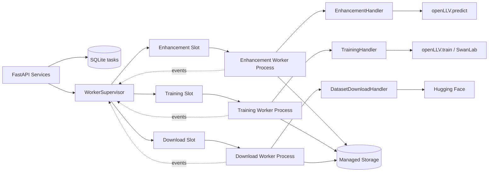
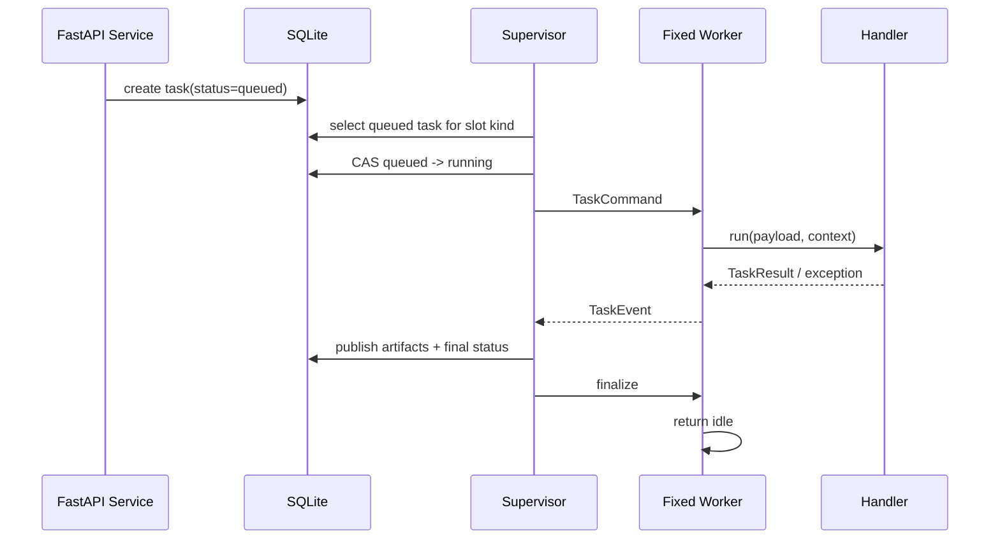

# openLLV WebUI Worker 架构

> 状态：提案  
> 适用阶段：Demo / 单机部署  
> 更新日期：2026-08-21

## 1. 目标

Worker 子系统负责在 FastAPI 进程之外执行耗时任务，并统一管理增强、训练和数据集下载三类任务。

必须满足：

- FastAPI 请求线程和事件循环不执行 `openLLV.predict()` 或 `openLLV.train()`。
- enhancement、training、dataset_download 三类任务可以并行。
- 同一个任务类型同时最多执行一个任务。
- 同类型的后续任务持久化排队，不因为 API 请求结束而丢失。
- 任务可以取消、失败、超时和恢复。
- worker 崩溃不会导致其他类型 worker 停止。
- worker 不直接持有 FastAPI app 或跨进程共享 SQLAlchemy Session。

## 2. 固定并发模型

Demo 阶段不使用动态 worker 池，也不按每个 task 创建新进程。FastAPI lifespan 启动三个固定 worker slot：

```text
WorkerSupervisor
|-- enhancement slot       -> Enhancement Worker
|-- training slot          -> Training Worker
`-- dataset_download slot  -> Download Worker
```

并发规则：

```text
enhancement-1  running   enhancement-2  queued
training-1     running
download-1     running
```

上面三个任务可以同时执行。`enhancement-2` 必须等待 `enhancement-1` 完成，因为同一个 slot 同时只允许一个 active task。

### 2.1 为什么使用固定 slot

- 任务类型数量少且稳定。
- Demo 阶段不需要动态计算资源并发度。
- 每个 slot 的取消、重启和故障边界清晰。
- 训练和增强可以分别维护自己的模型运行环境。
- 后续扩展为独立 worker 服务时，slot 可以直接拆成服务实例。

### 2.2 不负责的调度能力

首期不实现：

- 多 GPU 自动调度。
- 动态 worker 数量。
- 任务优先级和抢占。
- 跨机器任务迁移。
- 资源预测和显存估算。
- 同一 kind 的并发大于 1。

## 3. 总体组件



### 3.1 FastAPI

FastAPI 只负责：

- 校验 API 请求。
- 创建 queued task。
- 查询 task 和结果。
- 发送取消请求。
- 返回 catalog 和 artifact。
- 通过 supervisor 读取 worker 状态。

FastAPI 不负责：

- 调用 openLLV 进行推理或训练。
- 直接修改 worker 进程内部状态。
- 通过全局变量保存唯一任务结果。
- 把客户端文件路径传给 worker。

### 3.2 WorkerSupervisor

Supervisor 在 FastAPI lifespan 中创建一个实例，负责三个 slot：

- 启动和监控三个固定 worker。
- 为每个 slot 领取对应 kind 的 queued task。
- 发送 `TaskCommand`。
- 接收 `TaskEvent`。
- 更新 task 状态和结果 artifact。
- 发送取消和关闭命令。
- 在 worker 异常退出后重启对应 slot。
- 清理对应 slot 的进程句柄和临时文件。

Supervisor 不调用 openLLV，也不实现具体业务参数映射。

### 3.3 Worker Process

三个 worker 进程使用同一个 `workers/process.py` 入口，通过启动参数或初始化 command 固定自己的 `worker_kind`：

```text
python -m backend.workers.process --kind enhancement
python -m backend.workers.process --kind training
python -m backend.workers.process --kind dataset_download
```

实际启动由 `multiprocessing` 的 `spawn` 完成，不建议由 shell 命令启动。

worker process 负责：

- 阻塞等待对应 slot 的 command。
- 根据 worker kind 加载 handler registry。
- 执行一个 task。
- 发送生命周期事件。
- 监听 control message。
- 清理 task 资源。
- 成功完成后等待 supervisor 的 finalize，再回到 idle 状态。

worker process 不负责：

- 创建或提交 SQLAlchemy Session。
- 直接更新 `tasks` 表。
- 读取任意客户端路径。
- 生成 HTTP response。

## 4. 文件布局

```text
backend/
`-- workers/
    |-- __init__.py
    |-- process.py              # 三个 worker 共用的子进程入口
    |-- supervisor.py           # 三个固定 slot 的生命周期管理
    |-- slot.py                 # 单 slot 的进程 handle 和 active task
    |-- protocol.py             # command、event、control message
    |-- context.py              # WorkerContext 和本地取消状态
    |-- registry.py              # worker kind -> handler
    `-- handlers/
        |-- __init__.py
        |-- base.py             # TaskHandler、TaskResult
        |-- enhancement.py
        |-- training.py
        `-- dataset_download.py
```

依赖方向：

```text
api/services -> supervisor
supervisor -> protocol / slot / process
process -> context / registry / handlers
handlers -> integrations / storage helpers
```

禁止反向依赖：

- handler 不导入 FastAPI route。
- handler 不导入 API schema 作为数据库模型。
- process 不导入 app factory 或 lifespan。
- process 不导入全局 engine、SessionLocal 或 database module。
- supervisor 不直接调用 openLLV。

## 5. Handler Registry

### 5.1 Handler 接口

三种任务使用同一个 handler 协议，但保留各自业务参数和结果处理。

```text
TaskHandler
|-- validate(payload)
|-- run(payload, context)
|-- build_result(outcome, context)
`-- cleanup(context)
```

handler 的输入是已经由 API service 校验过、可序列化的 payload。handler 仍需在 worker 内做一次必要的防御性校验，不能相信跨进程数据永远有效。

### 5.2 Registry

```text
HANDLERS
|-- enhancement       -> EnhancementHandler
|-- training          -> TrainingHandler
`-- dataset_download  -> DatasetDownloadHandler
```

registry 只允许固定的三个 key。未知 kind 不能回退到任意 Python import 路径，避免将 task payload 变成代码执行入口。

### 5.3 EnhancementHandler

负责：

- 将 method、backend、checkpoint 和 params 映射到 `openLLV.predict()`。
- 解析 input artifact 到受管理的文件或目录。
- 单图结果写入 output 临时目录。
- 批量结果写入一个受管理输出目录。
- 把 PIL Image 或 NumPy 结果转换为 artifact publish 信息。

不负责：

- 写 `enhancement_jobs`。
- 直接创建 artifact 数据库记录。
- 接受任意 output directory。

### 5.4 TrainingHandler

负责：

- 将 model、dataset、epochs、batch_size、lr、resize 和 device 映射到训练 adapter。
- 请求没有 SwanLab 配置时调用 `openLLV.train()`。
- 请求存在 SwanLab 配置时调用 `BatchSwanLabTrainer` adapter。
- 保存 history、best_val_loss 和 checkpoint publish 信息。
- 处理训练中断和 checkpoint 查找。

SwanLab API key 从 worker 进程环境或受保护配置读取，不放入 `TaskCommand.payload`。

首期强制 `num_workers=0`，因为训练 dataloader 子进程会增加进程组清理和 macOS 行为的不确定性。

### 5.5 DatasetDownloadHandler

负责：

- 使用 job 中保存的 repo ID snapshot。
- 从允许的 Hugging Face 仓库逐文件下载。
- 每个文件开始前检查本地取消状态。
- 写入 dataset 临时目录。
- 完成后发布 dataset 目录 artifact。

repo ID 必须由 service 从服务端配置映射得到，不能从客户端 payload 直接信任。

## 6. WorkerContext

`WorkerContext` 是 handler 的运行时上下文，不包含 FastAPI app 或 SQLAlchemy Session。

```text
WorkerContext
|-- task_id
|-- worker_kind
|-- storage_paths
|-- cancel_event
`-- logger
```

### 6.1 storage_paths

只传入后端已经解析并验证过的路径：

- input paths。
- task temporary directory。
- output publish directory。
- checkpoint directory。
- dataset target directory。

handler 不接受未经验证的原始字符串路径。

### 6.2 cancel_event

control loop 在收到 `cancel` 后设置进程内的 `threading.Event`。下载 handler 在文件边界检查该 event。

openLLV 推理和训练是阻塞调用时，event 不保证立即打断；Supervisor 仍需要按宽限期发送 process-group signal。

## 7. 父子进程协议

协议对象定义在 `workers/protocol.py`，使用可 pickle 的简单 dataclass 或等价结构。

### 7.1 TaskCommand

```text
TaskCommand
|-- task_id
|-- kind
|-- payload
`-- storage_paths
```

约束：

- `kind` 必须等于固定 slot 的 worker kind。
- payload 只能包含 JSON-like 数据。
- 不包含 API key、Session、进程对象和 Python callable。
- storage paths 必须是 supervisor 解析后的受管理路径。

### 7.2 TaskEvent

```text
TaskEvent
|-- task_id
|-- kind
|-- type
|-- payload
`-- emitted_at
```

事件类型：

```text
started
succeeded
failed
```

`succeeded` payload 包含受管理文件或目录的 publish 信息，不包含最终数据库对象。Supervisor 负责创建 artifact 和更新任务状态。

`failed` payload 包含：

```text
error_code
safe_message
retryable
```

不发送完整 traceback 到 API。详细 traceback 只进入受控日志，且需要过滤密钥和绝对路径。

### 7.3 ControlMessage

```text
ControlMessage
|-- task_id
`-- type: cancel | shutdown | finalize | discard
```

worker 收到 task ID 与当前 active task 不匹配的 cancel 时忽略该消息并写入 warning，防止旧任务的取消信号作用到新任务。

### 7.4 Pipe 方向

每个固定 worker 有两条方向明确的通信通道：

```text
worker -> supervisor: event Pipe
supervisor -> worker: control/command Pipe
```

不要使用一个双向无协议的共享 queue 承担所有消息，避免 command 和 event 混淆。

## 8. Slot 状态

每个固定 slot 维护临时运行状态：

```text
starting -> idle -> busy -> idle
              |       |
              v       v
            dead <- stopping
```

slot 状态不是数据库中的 task status。数据库 task status 是持久化业务状态，slot state 是 supervisor 内存中的进程状态。

### Slot handle

```text
WorkerSlot
|-- kind
|-- process
|-- command_pipe
|-- event_pipe
|-- active_task_id
`-- state
```

`WorkerSlot` 不存放业务结果。结果通过 TaskEvent 发送给 supervisor，再由 supervisor 发布 artifact 和更新数据库。

## 9. 任务领取流程



领取规则：

1. 每个 slot 只查询自己的 `kind`。
2. 按 `created_at ASC, id ASC` 领取。
3. 使用 `WHERE id = ? AND status = 'queued'` 的条件更新。
4. CAS 失败时不发送 command。
5. task 标记 running 后才发送 command。
6. command 发送失败时将 task 标记为 failed，并重启对应 slot。

## 10. 正常完成流程

正常完成后，固定 worker 不退出，而是回到 idle：

1. handler 写入 task 临时目录。
2. handler 计算文件元数据和 publish path。
3. worker 发送 succeeded event，并等待 supervisor 的 finalize/discard 响应。
4. supervisor 校验 task ID 和 slot kind。
5. supervisor 将文件发布到目标 managed root。
6. supervisor 创建 artifact 记录。
7. supervisor 使用 CAS 将 task 更新为 succeeded。
8. supervisor 发送 finalize；worker 清理本次任务资源并回到 idle。
9. 如果发布或状态更新失败，supervisor 发送 discard；worker 清理本次任务并退出，由 supervisor 重启该 slot。

如果 artifact 创建或最终状态更新失败，task 不能标记为 succeeded。需要根据 publish recovery 规则保留临时文件或清理孤立文件。

## 11. 取消流程

### 11.1 queued task

1. API service 使用 CAS 将 task 从 queued 更新为 cancelled。
2. supervisor 不会为该 task 发送 command。
3. 如果 task 有预创建的临时目录，执行清理。

### 11.2 running task

1. API service 使用 CAS 将 task 从 running 更新为 cancelling。
2. supervisor 检查 task ID 和对应的固定 slot。
3. supervisor 发送 cancel control message。
4. 下载 handler 在文件边界停止；openLLV handler 先等待宽限期。
5. 超时后 supervisor 通过 worker process handle 终止进程。
6. worker 退出后 supervisor 清理临时文件。
7. supervisor 将 task 更新为 cancelled。
8. supervisor 重启对应固定 worker，避免复用可能处于不确定状态的运行环境。

不使用 `PyThreadState_SetAsyncExc`，不向 FastAPI 线程注入异常。

### 11.3 取消与成功竞争

成功事件不能无条件覆盖 cancelling：

```text
running + success event -> succeeded
running + cancel request -> cancelling -> cancelled
cancelling + success event -> discard result -> cancelled
```

最终顺序由数据库条件更新决定，而不是由 Python 内存中的状态决定。

## 12. 异常和重启

### 12.1 Handler 异常

普通 handler 异常：

1. worker 捕获异常并发送 safe failed event。
2. supervisor 将 task 标记为 failed。
3. supervisor 清理 task 临时目录。
4. 训练和增强 worker 默认退出并重启，避免复用可能污染的模型运行环境。
5. 下载 worker 也在异常后重启，避免复用不完整的下载状态。

### 12.2 Worker 进程崩溃

Supervisor 发现 event Pipe EOF 或 process exit code 非 0：

1. 根据 slot 的 active task 和 task ID 定位 task。
2. 如果 task 仍是 running/cancelling，标记 `failed`，错误码为 `worker_lost`。
3. 清理临时目录。
4. 回收 worker process handle。
5. 创建该 kind 的新 worker。
6. 不自动重试训练或推理，避免重复产生输出。

其他两个 worker slot 不受影响。

### 12.3 API 重启

FastAPI 启动时：

1. 将遗留 `running`/`cancelling` task 标记为 `failed/worker_lost`。
2. 启动三个新的固定 worker。
3. 继续领取 queued task。

旧 worker 通过 control Pipe EOF 或 parent watchdog 自行退出。Demo 阶段不持久化或从数据库恢复操作系统进程信息。

每个 worker 使用 `multiprocessing.Process` 句柄进行取消、shutdown 和重启。由于 `num_workers=0`，首期不维护 dataloader 子进程树。

## 13. 数据库边界

worker 进程不直接写数据库。数据库写入由 API service 和 supervisor 完成：

```text
API service:
  create task
  request cancel
  query task

Supervisor:
  claim task
  write started/final state
  create artifact references
  recover worker
```

所有 Session 都在所属进程内创建：

- FastAPI route 每次请求独立 Session。
- Supervisor 每次数据库操作使用独立 Session。
- worker 不创建数据库 Session。

数据库模型和协议模型分离：

```text
db.models.TaskCommand != workers.protocol.TaskCommand
db.models.Task != workers.protocol.TaskEvent
```

## 14. 日志和可观测性

每条 worker 日志至少包含：

```text
request_id
task_id
kind
event_type
```

必须记录：

- worker 启动、ready、idle、busy、stopping、dead。
- task claim、command send、event receive。
- handler 开始、成功、失败和取消。
- worker restart 原因。
- worker process cleanup 结果。

禁止记录：

- SwanLab API key。
- 完整 Authorization header。
- 未清理的绝对路径。
- 用户上传内容本身。

## 15. 测试边界

详细测试规则见 `docs/refactor/testing.md`。Worker 专项必须覆盖：

- 三个固定 slot 启动。
- 三个不同 kind 同时运行。
- 同 kind 第二个 task 排队。
- 一个 slot 失败不影响其他 slot。
- task cancel、worker restart 和 task ID 校验。
- handler 异常和 process crash。
- worker process handle 清理。
- API 重启后的 queued/running/cancelling 恢复。

默认使用 fake handler、fake process 和临时 SQLite。测试不得加载真实 openLLV 模型或执行真实下载。

## 16. 后续扩展

当出现以下需求时再拆分 worker 服务：

- 同一 kind 需要并发大于 1。
- 多 GPU 或多机器调度。
- FastAPI 需要多副本部署。
- worker 需要独立扩缩容。
- 任务数量超过 SQLite 的写入和轮询能力。

目标演进路径：

```text
当前：FastAPI lifespan + 三个固定 worker slot
  -> 独立 worker service + 共享数据库
  -> PostgreSQL + external queue + 多 worker 实例
```

演进时保留：

- Task kind 和 status 语义。
- TaskCommand / TaskEvent 概念。
- Handler 边界。
- API contract。
- artifact 和 managed storage 规则。
